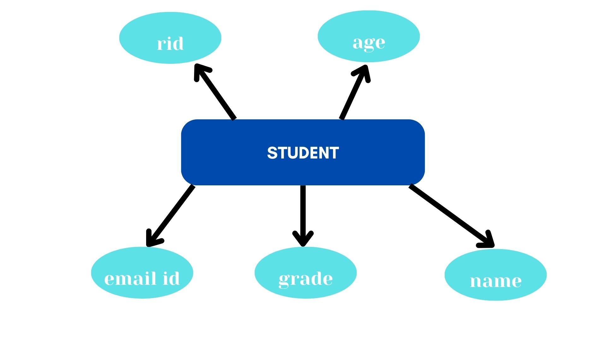
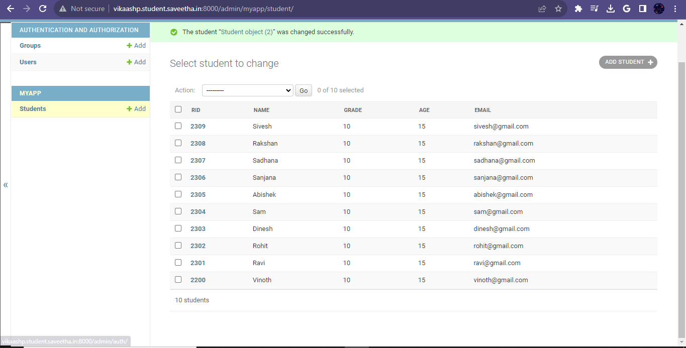

# Ex02 Django ORM Web Application

## AIM
To develop a Django application to store and retrieve data from a student database using Object Relational Mapping(ORM).

## Entity Relationship Diagram



## DESIGN STEPS

### STEP 1:
Clone the repository fro github
### STEP 2:
Creatte an admin interface in django

### STEP 3:
Create an app and edit settings.py

### STEP 4:
Enter the code for admin.py and models.py

### STEP 5:
Execute Django admin and create 10 employees


## PROGRAM

```
admin.py
from django.contrib import admin
from .models import Student,StudentAdmin
admin.site.register(Student,StudentAdmin)

models.py
from django.db import models
from django.contrib import admin
class Student (models.Model):
    rid=models.CharField(max_length=20,help_text="Student ID")
    name=models.CharField(max_length=100)
    grade=models.IntegerField()
    age=models.IntegerField()
    email=models.EmailField()

class StudentAdmin(admin.ModelAdmin):
    list_display=('rid','name','grade','age','email')

```    


## OUTPUT




## RESULT
The program for creating a student database using ORM is executed successfully.